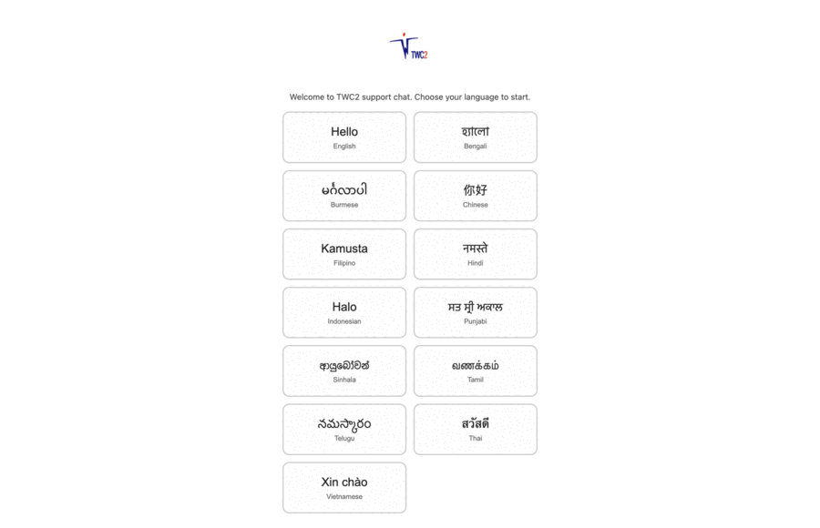
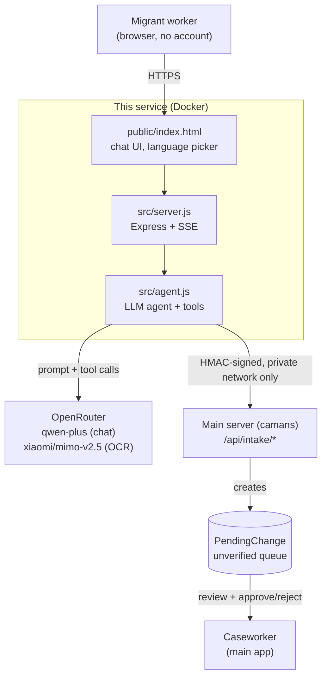

# TWC2 Support Chat

Public, no-login LLM chat service for migrant workers to self-report case updates — currently MC (medical certificate) status. Standalone Node service, deployed separately from TWC2's main case-management app (`camans`), which it talks to only over a private, HMAC-signed intake API.

**Nothing a worker submits ever writes to a real record directly.** Every submission becomes a `PendingChange` row in the main app, which a caseworker reviews and approves/rejects.

## Walkthrough

Worker picks a language, verifies identity, updates MC status conversationally, then the caseworker sees it land in the main app's review queue with a reference number:



## Architecture



This repo only owns the `worker ↔ agent ↔ intake-call` slice. The main server, its DB, and the review UI live in the separate `camans` repo — the intake endpoints are the entire contract between the two.

## Identity verification

No worker accounts. A worker proves who they are with an exact **name + FIN + birth year** match against the main app's records (`POST /api/intake/verify-worker`). No partial feedback on mismatch — same generic "couldn't verify" message regardless of which field was wrong, to prevent field-by-field brute forcing, and it doesn't reveal whether "wrong details" or "not a client at all" is the actual reason. Session + IP rate-limited with lockout; CAPTCHA (Cloudflare Turnstile) required starting the second failed attempt. No match → worker is told to visit the TWC2 office in person; there's no online recovery path by design.

## Rate limiting

Three layers, each independent of the others:

- **IP floor** (`express-rate-limit`, in `server.js`): 60 req/min per IP across all `/api/*` routes, 10 req/min per IP on `/api/chat/start` specifically (each hit there is a paid LLM call before any session exists). Keyed by IP, not session — the layer below is bypassable by rotating session ID, so this catches that.
- **Per-session** (`rateLimit.js`): messages/min, uploads/session, keyed by `session.id`. Cheap and simple, but `X-Session-Id` is client-supplied and unverified, so this alone isn't a real ceiling against a scripted attacker minting new session IDs.
- **Identity-match specific**: tighter cap + session/IP lockout on `verify_identity` attempts, since that endpoint is an oracle (match/no-match) an attacker could otherwise brute-force.

Cloudflare (edge, in front of all of this) is meant to add a coarser IP/ASN-level layer on top per the original design — the in-app IP floor exists so the service isn't defenseless if that's misconfigured or bypassed by hitting the origin directly.

## LLM usage

| Purpose | Model | Why |
|---|---|---|
| Conversation + tool-calling (`verify_identity`, `submit_mc_status`) | `qwen/qwen-plus` via OpenRouter | Far cheaper than Claude Sonnet (~8-13x) with reliable tool-calling under real multi-turn load. Two cheaper models tried first (`qwen2.5-72b-instruct`, `qwen3-coder-flash`) both failed live tool-calling tests — one emitted the tool call as literal text instead of a structured call once the conversation had real history, not just on a first turn. |
| OCR (ID card / MC certificate photos) | `xiaomi/mimo-v2.5` | Vision-capable, cheap. Treated as a **hint only** — extracted fields still require the worker's confirmation before use, and identity is still verified against the DB, never trusted from a photo. |

Tool-based extraction, not prose-then-parse: the model must call `verify_identity` before discussing any case matter, and `submit_mc_status` only after the worker confirms a plain-language recap. System prompt + tool defs are cached (`cache_control: ephemeral`, same syntax as Anthropic) since they're identical every turn. Replies stream over SSE, parsed manually client-side (`EventSource` can't POST a body, so it's `fetch` + `ReadableStream` instead).

### Tools (`src/agent.js`)

| Tool | Params (required in **bold**) | Purpose |
|---|---|---|
| `verify_identity` | **`name`**, **`fin`**, **`yearOfBirth`** | Match worker's name + FIN + birth year against TWC2 records. Must be called before any case discussion. Returns match/no-match only — no other info (prevents field-by-field brute forcing). |
| `submit_mc_status` | **`mcStatus`** (enum: `MC`, `Light duty`, `No MC or LD`, `Other`), `mcStatusMore`, **`dateMcInfoReceived`**, `dateMcExpires`, `mcDaysCumul`, `dateLdExpires`, `ldDaysCumul`, `mcStatusRemarks` | Submit collected MC status as a `PendingChange` for caseworker review. Only callable after identity verification + worker confirmation of recap. |

`mcStatus` enum mirrors the main app's live "MC status" dropdown exactly — must stay in sync if that dropdown's options change.

## Key tradeoffs

- **Same VPS as the main app, isolated by Docker container** rather than a separate VPS — cost-driven. Container namespacing stops an app-level compromise here from reading the main server's files/env; it doesn't stop a kernel-level container escape, judged an acceptable risk at this scale.
- **HMAC, not mTLS**, for calls into the main server's intake API — the link is private-network only, so HMAC (`X-Intake-Timestamp` / `X-Intake-Signature`, already used by the existing intake route) is sufficient without cert-management overhead.
- **In-memory session/rate-limit store, not Redis** — single instance, one-sitting conversations, no cross-session persistence needed. Revisit if this service is ever horizontally scaled.
- **Session ID via explicit `X-Session-Id` header + `localStorage`, not a cookie** — Safari was found to silently drop the session cookie on repeat requests, turning every message into a fresh, memory-less session. An app-level header sidesteps browser cookie-jar quirks entirely (also more robust in in-app browsers like WhatsApp/Messenger, which is realistically how workers open this link).
- **Attachments (e.g. MC certificate photos) saved to disk immediately**, before any caseworker review — only the `PendingChange` row pointing at the file is gated on approval. Holding a raw image buffer in memory across chat turns was judged worse than an orphaned file on reject.

## Running locally

```bash
npm install
cp .env.example .env   # fill in the values below
npm run dev
```

**Required:**

- `OPENROUTER_API_KEY`
- `MAIN_SERVER_INTERNAL_URL`
- `INTAKE_HMAC_SECRET` — must match the main server's `CHAT_INTAKE_HMAC_SECRET`
- `TURNSTILE_SECRET_KEY`
- `PUBLIC_URL`
- `PORT`

**Optional** (default shown):

- `OPENROUTER_MODEL` (`qwen/qwen-plus`)
- `OPENROUTER_VISION_MODEL` (`xiaomi/mimo-v2.5`)
- `CHAT_MAX_TURNS` (`25`)
- `CHAT_MESSAGES_PER_MINUTE` (`15`)
- `IDENTITY_MATCH_MAX_ATTEMPTS` (`4`)
- `IDENTITY_LOCKOUT_MINUTES` (`30`)
- `ID_UPLOAD_MAX_PER_SESSION` (`6`)

## Deploy

`Dockerfile` builds a standalone image (`node:20-alpine`, no dev deps, serves `public/` + `src/`); `docker-compose.yml` wires it up. Meant to sit behind Cloudflare (DNS/TLS/edge rate-limiting) on the same host as the main `camans` server, with the main server's intake port bound to localhost/internal-network only — never exposed publicly.
